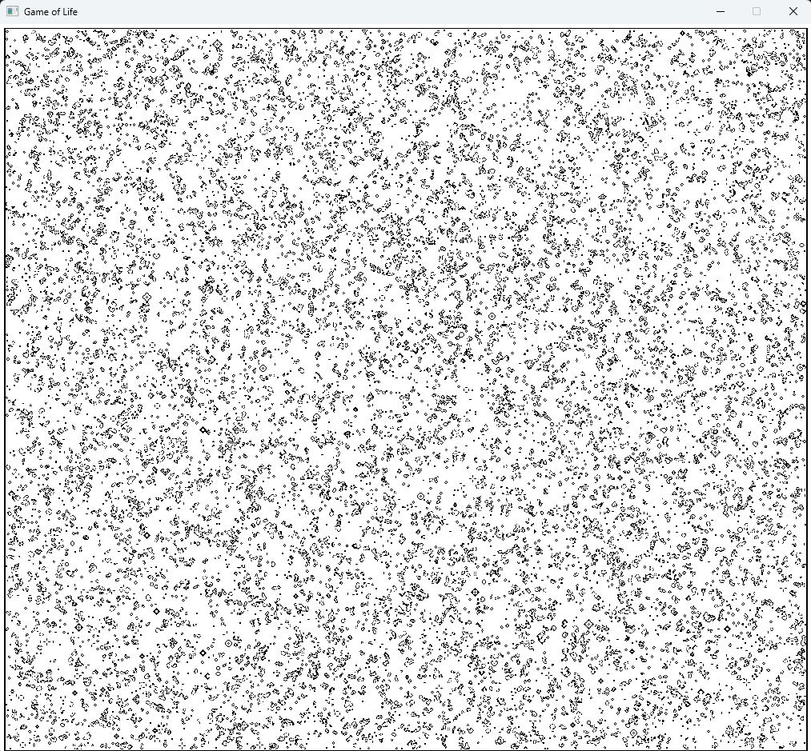
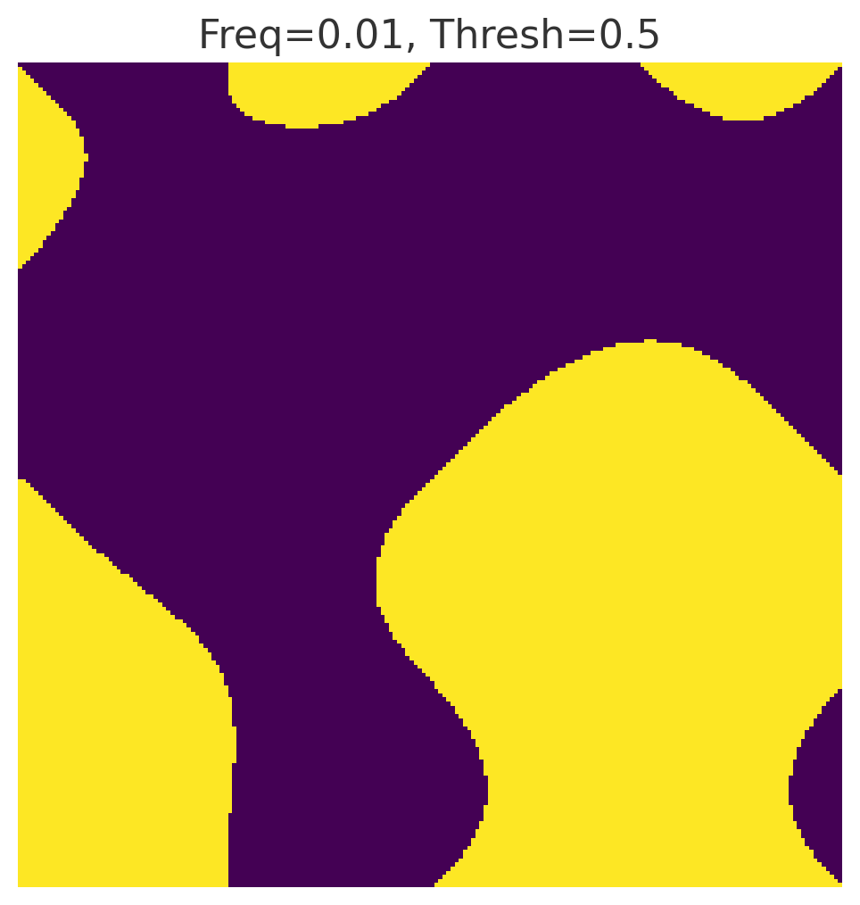
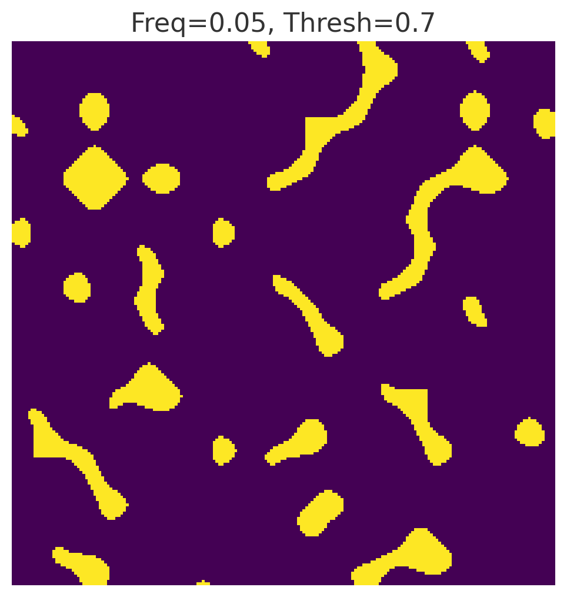

# Conway's Game of life optimized for dense grids
## INTRO
The Game of Life, also known as Conway's Game of Life or simply Life, is a cellular automaton devised by the British mathematician John Horton Conway in 1970. It is a zero-player game, meaning that its evolution is determined by its initial state, requiring no further input. One interacts with the Game of Life by creating an initial configuration and observing how it evolve. [https://en.wikipedia.org/wiki/Conway%27s_Game_of_Life]

  

## RULES
The Game of Life is an infinite two-dimensional grid with square cells, that could be in either in a state of live or dead. Each cell is influenced by the state of its nearest eight neighbors, in the cardinal and diagonal direction. Four simple rules (based on models of population growth) dictate the state of any cell at a particular generation (each iteration of state):
- Any live cell with fewer than two live neighbors dies. [Underpopulation]
- Any live cell with more than three live neighbors dies. [Overcrowding]
- Any live cell with two or three live neighbors continues to the next generation. [Stable populations]
- Any dead cells of exactly three live neighbors will come back to life. [Reproduction]
## IMPLEMENTATION
This project focuses on a finite grid, exploring different types of initializations for the first frame. The main objective was not to study initial conditions themselves, but rather to practice OpenMP syntax and develop a deeper understanding of parallelization techniques.

To create a meaningful need for parallelization, I chose a grid that is either very large or extremely dense. A dense grid naturally highlights the performance impact of optimized computation, especially when fast updates are required.
For simplicity, I worked with a 300×400 cell grid, updated 10 times per second. This setup strikes a balance between complexity and practicality, while making the benefits of parallel processing immediately visible.

### Limitations
A much higher cell count is supported by the implementation, although performance naturally depends on hardware capabilities. In my setup, performance started to deteriorate around the order of 10⁷ cells, which I considered acceptable given that updating 10⁷ cells 10 times per second is already significant.

Even when only considering the backend computation — ignoring visualization and all related optimizations — the load is substantial. For instance, applying the update rules across 10⁸ cells each second (approximately 8 operations per cell) gives a sense of the scale of computations involved.

  

For reference this is just about 10⁶ cells, each 1x1 pixel of dimension

### Considerations on Visualization

To create the illusion of each frame rendering instantly—rather than drawing each cell one by one—each iteration first renders the entire grid to an off-screen bitmap, then copies (blits) it to the display window in a single step. This may make each iteration sligtly slower, but gives much smoother, more “instant” updates.

> **Note:** The underlying draw calls are still sequential, it’s just that the blit happens so quickly it feels instantaneous.

## INITIALIZATION
The solution presents 3 different generation methods, the first `InitializeGridUniform()` is a simple uniform distribution between dead and alive. It works - no one should be worried about issues of this - but the random values are generated by `td::mt19937_64`, it is a sequential vector seeded before the parallel region.
During the parallel the thread race to get access to the "random values" creating race condition only clear after evaluating the generator. 

> **Note:** The grid is very claerly not statistically independent

This is not really a problem because it only need to generate the grid and start it, but exploring a little deeper:
### Randomness
A very simple fix for the race condition is to move and privatize the random number generator inside each thread.
This prevents corruption of the shared generator without sacrificing performance by avoiding the use of a critical region.
Each thread initializes its own generator with a different seed, ensuring DIFFERENT random streams.
Focus on the different, not INDEPENDENT. Also, if all possible generations of `std::mt19937_64` define a domain, it is finite, and each thread’s stream of values creates a subdomain that could intersect with another’s.
Still a better solution but it isn't present in the project.

> **Note:** Here is not really an issue but in application like Monte Carlo simultation this could lead to oversampling in overlapping regiorns.

### Divided subdomains
The solution proposed, `InitializeGridUniform_LeapFrog()`, updates the uniform distribution using a leapfrog access scheme.
It generates the full random sequence before entering the parallel region, and then each thread reads successive values at regular intervals.
Specifically, if there are N threads:

Thread 0 takes values at indices 0, N, 2N, ...

Thread 1 takes values at indices 1, N+1, 2N+1, ...

and so on.

This ensures that threads read disjoint parts of the random sequence, avoiding collisions or race conditions.
Values are different and there is not potential oversampling, but given the dependecy on a single generator each stream possess a correlation to another.
Still this solution is adopted.

### Perlin noise
When looking at the images — and even more so while watching the application run — the behavior of the small cells feels surprisingly biological.
The way they are called "cells," switching between "alive" and "dead," naturally suggests the idea of an evolving, living mass.
Today, Perlin noise is widely used for exactly this reason: it produces randomness with an organic feel.
It appears in many areas of computer graphics where natural randomness is needed, such as:
- Fire
- Clouds
- Mountain terrains

This impression pushed me to add a Perlin noise-based generator for the grid initialization, `InitializeGridPerlin(double frequency, double threshold)`.
While this implementation is still deterministic, Perlin noise creates patterns that feel random yet cohesive, making it perfect for generating natural-looking structures.
Also, this could be expanded to pseudo-random simply by randomizing tha hash table.

Here are some examples of grids generated by perlin noise:

  
  

